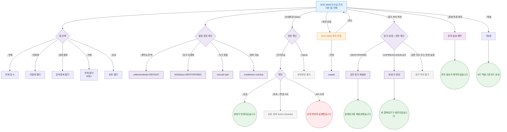

## 1. 목적
미수금 관리의 탭 전환, 발생 유형 확인, 상태 변경, 메모 편집, 결제링크 후속 액션 흐름을 표현한다.

## 2. 전제조건
- SCR-S008 진입 완료

## 3. 다이어그램

## 4. 엣지 설명

| 출발 | 도착 | 설명 |
|------|------|------|
| S008 | STATUS_AUTH | 상태변경 Select 조작 |
| STATUS_AUTH | STATUS_BLOCKED | 트레이너 차단 |
| STATUS_UPDATE | TOAST_STATUS_OK | 상태 변경 성공 |
| STATUS_UPDATE | TOAST_STATUS_ERR | API 오류 |
| SOURCE_TYPE | TYPE_LINK | 링크 미결제 원인 확인 |
| LINK_RESEND_CHECK | LINK_RESEND | 링크 미결제 건 재발송 |
| S008 | NOTICE_SEND | 독촉 문자 발송 |
| S008 | DLG_S005 | 메모 편집 모달 |
