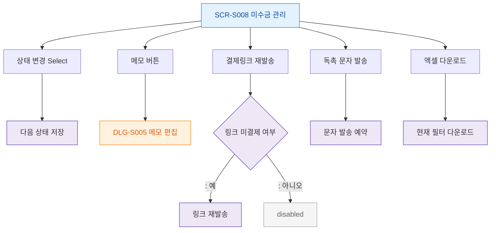

## 1. 목적
SCR-S008 미수금 관리 — F3_버튼액션 플로우.

## 2. 전제조건
- SCR-S008 진입 완료

## 3. 다이어그램

## 4. 엣지 설명
| 출발 | 도착 | 설명 |
|------|------|------|
| BTN_STATUS | STATUS_NEXT | 허용된 다음 상태로만 변경 |
| BTN_MEMO | DLG_S005 | 메모 편집 |
| BTN_LINK | LINK_RESEND | 링크 미결제 건 재발송 |
| BTN_LINK | LINK_BLOCK | 링크 건이 아니면 비활성 |
