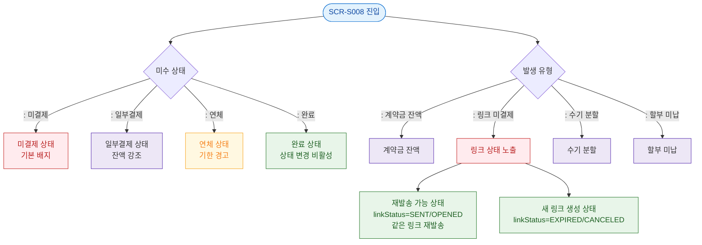

## 1. 목적
SCR-S008 미수금 관리 — F6_상태별 플로우.

## 2. 전제조건
- SCR-S008 진입 완료

## 3. 다이어그램

## 4. 엣지 설명
| 출발 | 도착 | 설명 |
|------|------|------|
| STATE_CHECK | UNPAID | 미결제 상태 |
| STATE_CHECK | PARTIAL | 일부결제 상태 |
| STATE_CHECK | OVERDUE | 연체 상태 |
| TYPE_CHECK | TYPE_LINK | 링크 미결제 원인 |
| TYPE_LINK | RESEND_READY | 활성 링크는 같은 링크를 재발송 |
| TYPE_LINK | LINK_RENEW | 만료/취소 링크는 새 링크 생성 |
