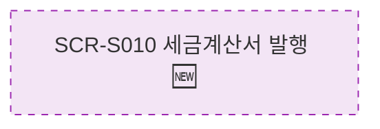

## 1. 목적
SCR-S010 세금계산서 발행(🆕 기획 초안) — F9_토스트 플로우.

## 2. 전제조건
- SCR-S010 진입 완료

## 3. 다이어그램

```mermaid
flowchart TD
    S010[SCR-S010 세금계산서 발행 🆕]
    classDef newFeature fill:#F3E5F5,stroke:#9C27B0,stroke-dasharray:5 5
    class S010 newFeature
```

## 4. 엣지 설명
화면설계서 SCR-S010 기준으로 작성 예정.
