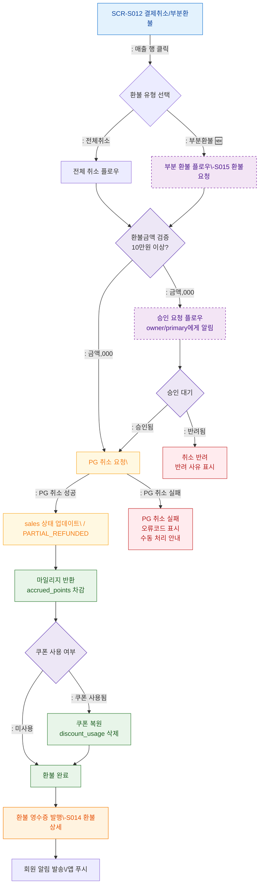

## 1. 목적
SCR-S012의 전체/부분 환불 처리 핵심 플로우를 표현한다. 승인 프로세스(10만원 이상), PG 취소 연동, 마일리지 반환까지 포함한다.

## 2. 전제조건
- SCR-S012 진입 완료
- 환불 대상 매출 선택됨

## 3. 다이어그램

## 4. 엣지 설명

| 출발 | 도착 | 설명 |
|------|------|------|
| SALE_DETAIL | FULL_REFUND | 전체 취소 선택 |
| SALE_DETAIL | PARTIAL_REFUND | 부분 환불 선택 (🆕) |
| AMOUNT_GATE | APPROVAL_FLOW | 10만원 이상 → 승인 필요 |
| AMOUNT_GATE | PG_CANCEL | 10만원 미만 → 즉시 처리 |
| WAIT_APPROVE | PG_CANCEL | 승인 완료 → PG 취소 진행 |
| WAIT_APPROVE | REJECTED | 반려 → 취소 불가 |
| PG_CANCEL | UPDATE_SALES | PG 취소 성공 |
| PG_CANCEL | PG_FAIL | PG 취소 실패 |
| UPDATE_SALES | MILEAGE_RETURN | 마일리지 차감 처리 |
| COUPON_CHECK | COUPON_RESTORE | 쿠폰 복원 |
| REFUND_COMPLETE | REFUND_RECEIPT | 환불 영수증 발행 |
| REFUND_RECEIPT | NOTIFY_MEMBER | 회원 알림 발송 |
