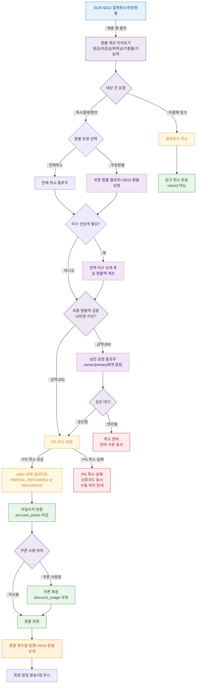

## 1. 목적
SCR-S012의 전체/부분 환불 처리 핵심 플로우를 `환불 계산 미리보기`, `미수 선상계`, `미결제 링크 취소`까지 포함해 표현한다.

## 2. 전제조건
- SCR-S012 진입 완료
- 환불 대상 매출 선택됨

## 3. 다이어그램

```mermaid
flowchart TD
    S012[SCR-S012 결제취소/부분환불] -->|": 매출 행 클릭"|PREVIEW[환불 계산 미리보기\n원금/차감금/위약금/기환불/가능액]
    PREVIEW --> PAYMENT_CASE{대상 건 유형}

    PAYMENT_CASE -->|": 미결제 링크"|LINK_CANCEL[결제링크 취소]
    PAYMENT_CASE -->|": 즉시결제/할부"|SALE_DETAIL{환불 유형 선택}

    SALE_DETAIL -->|": 전체취소"|FULL_REFUND[전체 취소 플로우]
    SALE_DETAIL -->|": 부분환불"|PARTIAL_REFUND[부분 환불 플로우\-S015 환불요청]

    FULL_REFUND --> OFFSET_CHECK{미수 선상계 필요?}
    PARTIAL_REFUND --> OFFSET_CHECK
    OFFSET_CHECK -->|": 예"|OFFSET_APPLY[잔여 미수 상계 후\n실 환불액 계산]
    OFFSET_CHECK -->|": 아니오"|AMOUNT_GATE{최종 환불액 검증\n10만원 이상?}
    OFFSET_APPLY --> AMOUNT_GATE

    AMOUNT_GATE -->|": 금액,000"|APPROVAL_FLOW[승인 요청 플로우\nowner/primary에게 알림]
    AMOUNT_GATE -->|": 금액,000"|PG_CANCEL[PG 취소 요청]

    APPROVAL_FLOW --> WAIT_APPROVE{승인 대기}
    WAIT_APPROVE -->|": 승인됨"|PG_CANCEL
    WAIT_APPROVE -->|": 반려됨"|REJECTED[취소 반려\n반려 사유 표시]

    PG_CANCEL -->|": PG 취소 성공"|UPDATE_SALES[sales 상태 업데이트\nPARTIAL_REFUNDED or REFUNDED]
    PG_CANCEL -->|": PG 취소 실패"|PG_FAIL[PG 취소 실패\n오류코드 표시\n수동 처리 안내]

    UPDATE_SALES --> MILEAGE_RETURN[마일리지 반환\naccrued_points 차감]
    MILEAGE_RETURN --> COUPON_CHECK{쿠폰 사용 여부}
    COUPON_CHECK -->|": 쿠폰 사용됨"|COUPON_RESTORE[쿠폰 복원\ndiscount_usage 삭제]
    COUPON_CHECK -->|": 미사용"|REFUND_COMPLETE[환불 완료]
    COUPON_RESTORE --> REFUND_COMPLETE

    REFUND_COMPLETE --> REFUND_RECEIPT[환불 영수증 발행\-S014 환불상세]
    REFUND_RECEIPT --> NOTIFY_MEMBER[회원 알림 발송\/앱 푸시]
    LINK_CANCEL --> LINK_DONE[링크 취소 완료\nrefund 아님]

    classDef screen fill:#E3F2FD,stroke:#1976D2,color:#0D47A1
    classDef newFeature fill:#F3E5F5,stroke:#7B1FA2,color:#4A148C,stroke-dasharray:4 4
    classDef error fill:#FFEBEE,stroke:#C62828,color:#B71C1C
    classDef success fill:#E8F5E9,stroke:#2E7D32,color:#1B5E20
    classDef warning fill:#FFF8E1,stroke:#F9A825,color:#F57F17
    classDef system fill:#EDE7F6,stroke:#5E35B2
    classDef modal fill:#FFF3E0,stroke:#F57C00,color:#E65100

    class S012 screen
    class PARTIAL_REFUND,APPROVAL_FLOW,OFFSET_APPLY newFeature
    class PG_FAIL,REJECTED error
    class REFUND_COMPLETE,MILEAGE_RETURN,COUPON_RESTORE,LINK_DONE success
    class PREVIEW,PAYMENT_CASE,AMOUNT_GATE,WAIT_APPROVE,COUPON_CHECK system
    class REFUND_RECEIPT modal
    class PG_CANCEL,UPDATE_SALES,LINK_CANCEL warning
```

## 4. 엣지 설명

| 출발 | 도착 | 설명 |
|------|------|------|
| PAYMENT_CASE | LINK_CANCEL | 미결제 링크는 환불 대신 링크 취소 |
| SALE_DETAIL | FULL_REFUND | 전체 취소 선택 |
| SALE_DETAIL | PARTIAL_REFUND | 부분 환불 선택 |
| OFFSET_CHECK | OFFSET_APPLY | 잔여 미수 선상계 |
| AMOUNT_GATE | APPROVAL_FLOW | 10만원 이상 → 승인 필요 |
| AMOUNT_GATE | PG_CANCEL | 10만원 미만 → 즉시 처리 |
| WAIT_APPROVE | PG_CANCEL | 승인 완료 → PG 취소 진행 |
| WAIT_APPROVE | REJECTED | 반려 → 취소 불가 |
| PG_CANCEL | UPDATE_SALES | PG 취소 성공 |
| PG_CANCEL | PG_FAIL | PG 취소 실패 |
| UPDATE_SALES | MILEAGE_RETURN | 마일리지 차감 처리 |
| COUPON_CHECK | COUPON_RESTORE | 쿠폰 복원 |
| REFUND_COMPLETE | REFUND_RECEIPT | 환불 영수증 발행 |
| REFUND_RECEIPT | NOTIFY_MEMBER | 회원 알림 발송 |
