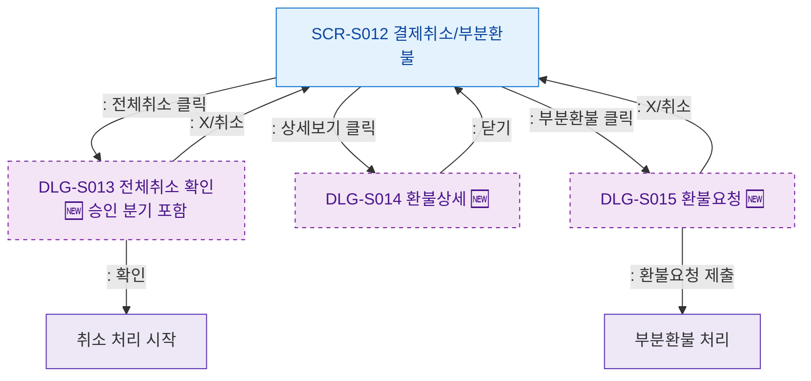

## 1. 목적
SCR-S012에서 발생하는 모달 트리거 경로를 표현한다.

## 2. 전제조건
- SCR-S012 진입 완료

## 3. 다이어그램

## 4. 엣지 설명

| 출발 | 도착 | 설명 |
|------|------|------|
| S012 | DLG_013 | 전체취소 확인 모달 |
| S012 | DLG_014 | 환불 상세 모달 |
| S012 | DLG_015 | 부분환불 요청 모달 |
| DLG_013 | PROCESS_CANCEL | 취소 확인 |
| DLG_015 | PROCESS_PARTIAL | 부분환불 제출 |
