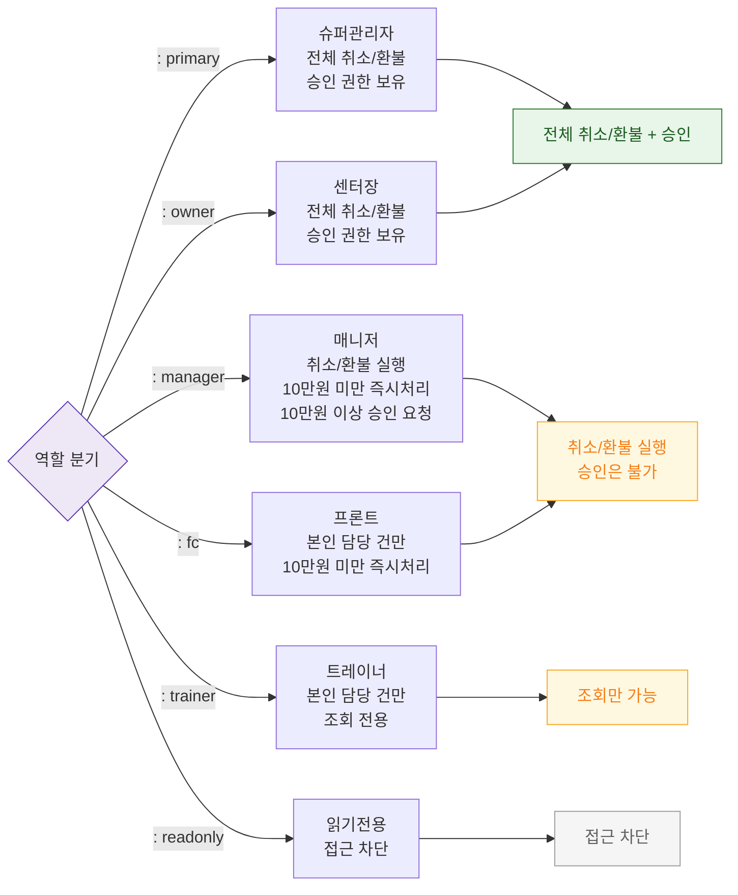

## 1. 목적
SCR-S012에서 역할별 접근 범위와 승인 권한을 표현한다.

## 2. 전제조건
- 로그인 완료

## 3. 다이어그램

## 4. 엣지 설명

| 출발 | 도착 | 설명 |
|------|------|------|
| AUTH | P | 슈퍼관리자 — 전체 권한 + 승인 |
| AUTH | O | 센터장 — 전체 권한 + 승인 |
| AUTH | M | 매니저 — 실행 가능, 승인 불가 |
| AUTH | FC | 프론트 — 담당 건 제한 |
| AUTH | TR | 트레이너 — 조회 전용 |
| AUTH | RO | readonly — 접근 차단 |
