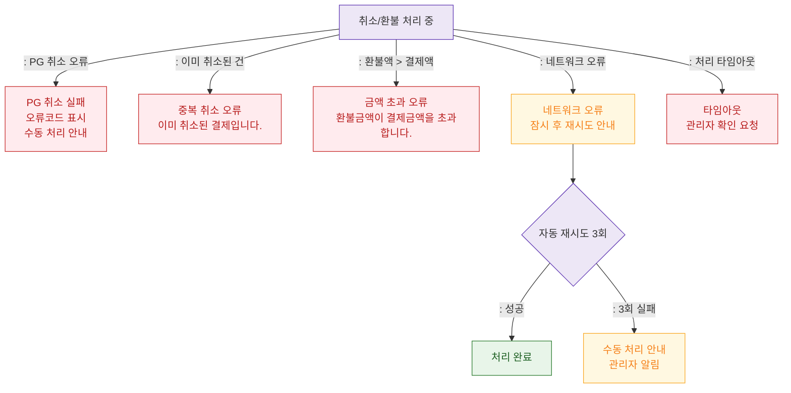

## 1. 목적
SCR-S012에서 발생 가능한 에러 및 예외 상황을 표현한다.

## 2. 전제조건
- SCR-S012에서 취소/환불 요청 실행 중

## 3. 다이어그램

## 4. 엣지 설명

| 출발 | 도착 | 설명 |
|------|------|------|
| PROCESS | PG_ERR | PG 취소 실패 |
| PROCESS | DUPLICATE_ERR | 중복 취소 시도 |
| PROCESS | EXCEED_ERR | 부분환불액 초과 |
| PROCESS | NET_ERR | 네트워크 오류 |
| PROCESS | TIMEOUT_ERR | 처리 타임아웃 |
| NET_ERR | NET_RETRY | 자동 재시도 |
| NET_RETRY | MANUAL_PROCESS | 3회 실패 → 수동 처리 |
