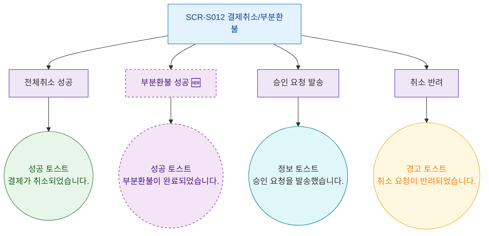

## 1. 목적
SCR-S012에서 발생하는 모든 토스트/피드백 메시지의 발생 조건을 표현한다.

## 2. 전제조건
- SCR-S012 진입 완료

## 3. 다이어그램

## 4. 엣지 설명

| 출발 | 도착 | 토스트 타입 | 메시지 |
|------|------|-------------|--------|
| EVT_CANCEL_OK | TOAST_S_CANCEL | success | 결제가 취소되었습니다. |
| EVT_PARTIAL_OK | TOAST_S_PARTIAL | success | 부분환불이 완료되었습니다. |
| EVT_APPROVAL_SENT | TOAST_I_APPROVAL | info | 승인 요청을 발송했습니다. |
| EVT_REJECTED | TOAST_W_REJECT | warning | 취소 요청이 반려되었습니다. |
