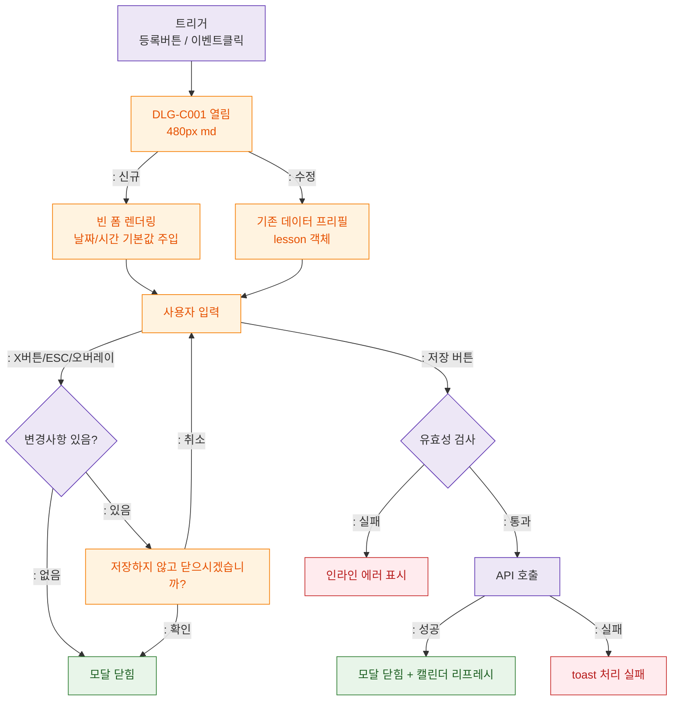

## 1. 목적
DLG-C001 수업등록/수정(캘린더) 모달의 열림/닫힘/제출 생명주기를 정의한다.

## 2. 전제조건
- SCR-C001 진입 완료
- 수업 등록 버튼 또는 캘린더 이벤트 클릭

## 3. 다이어그램

## 4. 엣지 설명

| 설명 |
|------|
| 신규(빈폼) / 수정(프리필) 분기 |
| 닫기 시 변경사항 확인 다이얼로그 |
| 저장 → 유효성 → API → 성공/실패 |
