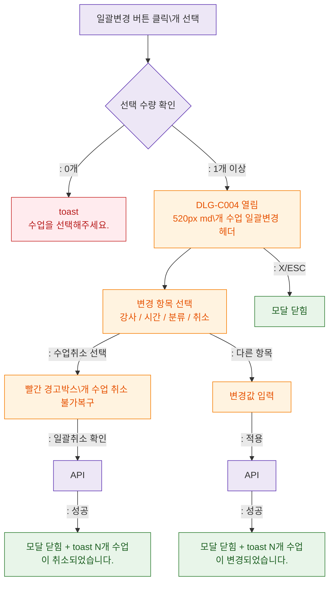

## 1. 목적
DLG-C004 일괄변경 모달의 생명주기를 정의한다.

## 2. 전제조건
- SCR-C002에서 1개 이상 수업 선택 후 일괄변경 버튼 클릭

## 3. 다이어그램

```mermaid
flowchart TD
  Trigger[일괄변경 버튼 클릭\개 선택] --> CountCheck{선택 수량 확인}
  CountCheck -->|": 0개"|NoSelect[toast\n수업을 선택해주세요.]
  CountCheck -->|": 1개 이상"|Open[DLG-C004 열림\n520px md\개 수업 일괄변경 헤더]

  Open --> FieldSelect[변경 항목 선택\n강사 / 시간 / 분류 / 취소]
  FieldSelect -->|": 수업취소 선택"|CancelWarn[빨간 경고박스\개 수업 취소 불가복구]
  FieldSelect -->|": 다른 항목"|NormalInput[변경값 입력]

  CancelWarn -->|": 일괄취소 확인"|BulkCancel[API]
  NormalInput -->|": 적용"|BulkUpdate[API]

  BulkCancel -->|": 성공"|CloseCancel[모달 닫힘 + toast N개 수업이 취소되었습니다.]
  BulkUpdate -->|": 성공"|CloseUpdate[모달 닫힘 + toast N개 수업이 변경되었습니다.]

  Open -->|": X/ESC"|Close[모달 닫힘]

  classDef modal fill:#FFF3E0,stroke:#F57C00,color:#E65100
  classDef system fill:#EDE7F6,stroke:#5E35B2
  classDef success fill:#E8F5E9,stroke:#2E7D32,color:#1B5E20
  classDef error fill:#FFEBEE,stroke:#C62828,color:#B71C1C
  classDef warning fill:#FFF8E1,stroke:#F9A825,color:#F57F17
  class Open,FieldSelect,CancelWarn,NormalInput modal
  class Trigger,CountCheck,BulkCancel,BulkUpdate system
  class CloseCancel,CloseUpdate,Close success
  class NoSelect error
```

## 4. 엣지 설명

| 설명 |
|------|
| 선택 0개 → 경고 토스트 |
| 취소 선택 → 빨간 경고박스 |
| 일괄취소/변경 API 호출 |
