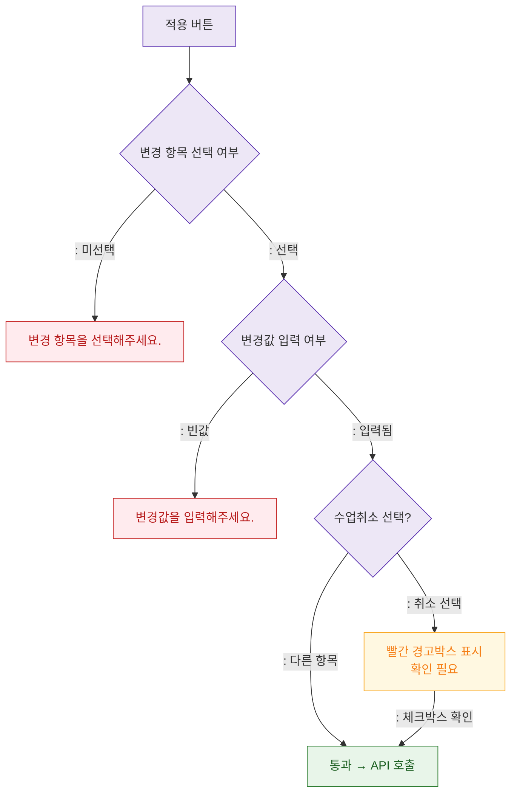

## 1. 목적
DLG-C004에서 변경 항목별 유효성 검사를 정의한다.

## 2. 전제조건
- DLG-C004 열림 상태

## 3. 다이어그램

## 4. 엣지 설명

| 검증 단계 | 규칙 |
|-----------|------|
| 항목 선택 | 최소 1개 항목 선택 필수 |
| 변경값 | 선택 항목에 맞는 값 필수 |
| 수업취소 | 빨간 경고박스 + 체크박스 확인 필수 |
