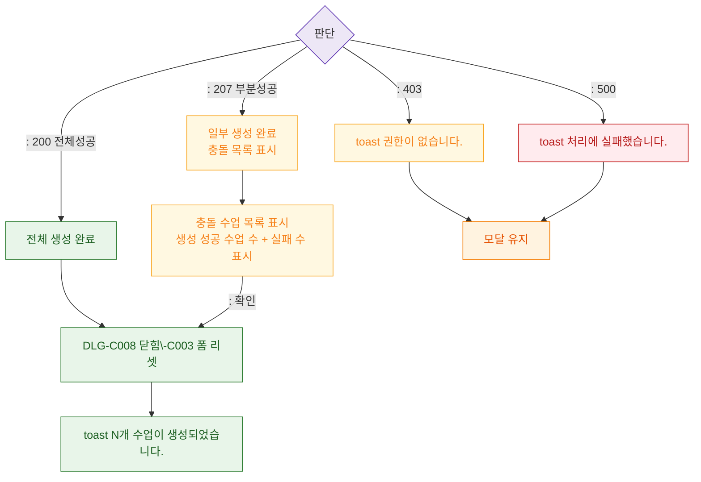

## 1. 목적
DLG-C008 일괄생성 API 결과 분기를 정의한다.

## 2. 전제조건
- 확인 클릭 후 API 호출

## 3. 다이어그램

## 4. 엣지 설명

| 응답 | 동작 |
|------|------|
| 200 | 전체 성공 → 닫힘 + success |
| 207 | 부분 성공 → 충돌 목록 표시 |
| 403/500 | 에러/경고 + 모달 유지 |
