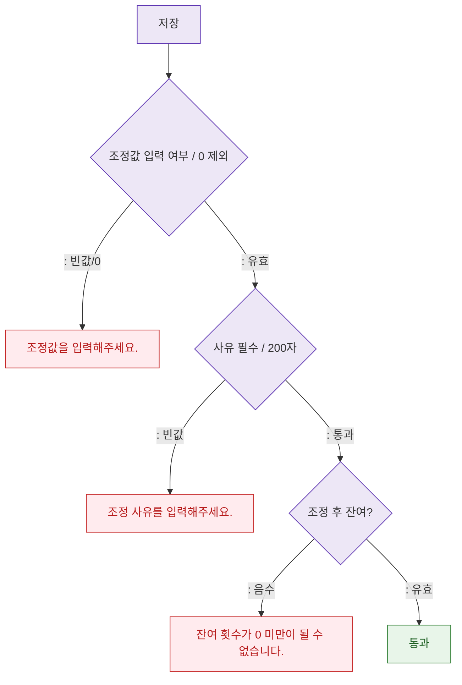

## 1. 목적
DLG-C012 조정값 및 사유 필드 검증을 정의한다.

## 2. 전제조건
- DLG-C012 열림, 저장 클릭

## 3. 다이어그램

```mermaid
flowchart TD
  Save[저장] --> V_Amount{조정값 입력 여부 / 0 제외}
  V_Amount -->|": 빈값/0"|E_Amount[조정값을 입력해주세요.]
  V_Amount -->|": 유효"|V_Reason{사유 필수 / 200자}
  V_Reason -->|": 빈값"|E_Reason[조정 사유를 입력해주세요.]
  V_Reason -->|": 통과"|V_Result{조정 후 잔여?}
  V_Result -->|": 음수"|E_Result[잔여 횟수가 0 미만이 될 수 없습니다.]
  V_Result -->|": 유효"|AllPass[통과]

  classDef system fill:#EDE7F6,stroke:#5E35B2
  classDef error fill:#FFEBEE,stroke:#C62828,color:#B71C1C
  classDef success fill:#E8F5E9,stroke:#2E7D32,color:#1B5E20
  class Save,V_Amount,V_Reason,V_Result system
  class E_Amount,E_Reason,E_Result error
  class AllPass success
```

## 4. 엣지 설명

| 필드 | 규칙 |
|------|------|
| 조정값 | 0이 아닌 정수 |
| 사유 | 필수, 최대 200자 |
| 조정 후 잔여 | 0 이상 |
