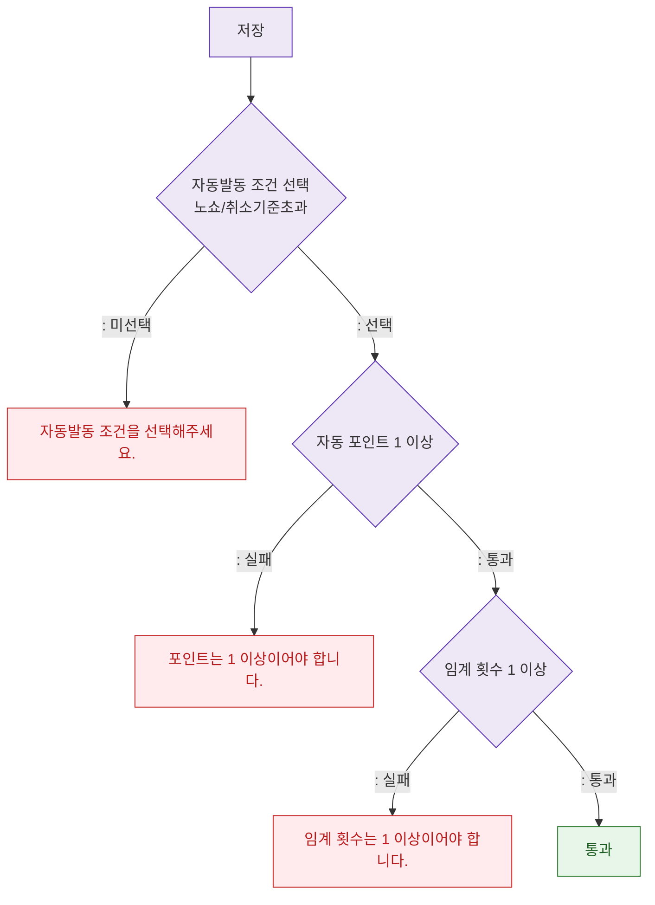

## 1. 목적
DLG-C015 자동 페널티 정책 필드 유효성 검사를 정의한다.

## 2. 전제조건
- DLG-C015 열림, 저장 클릭

## 3. 다이어그램

```mermaid
flowchart TD
  Save[저장] --> V_Trigger{자동발동 조건 선택\n노쇼/취소기준초과}
  V_Trigger -->|": 미선택"|E_Trigger[자동발동 조건을 선택해주세요.]
  V_Trigger -->|": 선택"|V_Point{자동 포인트 1 이상}
  V_Point -->|": 실패"|E_Point[포인트는 1 이상이어야 합니다.]
  V_Point -->|": 통과"|V_Threshold{임계 횟수 1 이상}
  V_Threshold -->|": 실패"|E_Threshold[임계 횟수는 1 이상이어야 합니다.]
  V_Threshold -->|": 통과"|AllPass[통과]

  classDef system fill:#EDE7F6,stroke:#5E35B2
  classDef error fill:#FFEBEE,stroke:#C62828,color:#B71C1C
  classDef success fill:#E8F5E9,stroke:#2E7D32,color:#1B5E20
  class Save,V_Trigger,V_Point,V_Threshold system
  class E_Trigger,E_Point,E_Threshold error
  class AllPass success
```

## 4. 엣지 설명

| 필드 | 규칙 |
|------|------|
| 자동발동 조건 | 필수 선택 |
| 자동 포인트 | 1 이상 정수 |
| 임계 횟수 | 1 이상 정수 |
