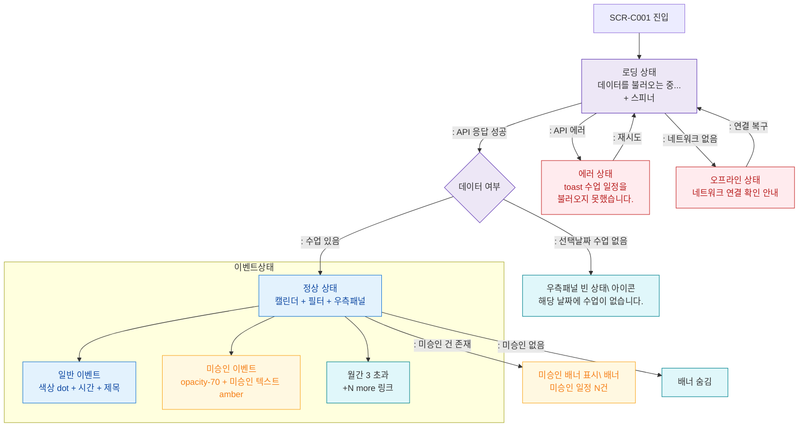

## 1. 목적
SCR-C001의 로딩/정상/빈/에러/미승인/오프라인 등 모든 UI 상태 분기를 정의한다.

## 2. 전제조건
- SCR-C001 진입 시도

## 3. 다이어그램

## 4. 엣지 설명

| 출발 | 도착 | 조건 |
|------|------|------|
| Loading | DataCheck | API 성공 |
| Loading | ErrorState | API 에러 |
| Loading | OfflineState | 네트워크 없음 |
| DataCheck | NormalState | 데이터 있음 |
| DataCheck | PanelEmpty | 선택날짜 수업 없음 |
| NormalState | PendingBanner | 미승인 건 존재 |
| NormalState | 이벤트 상태 | 이벤트 종류별 |
| 에러/오프라인 | Loading | 재시도 |
