## 1. 목적
SCR-C001에서 발생 가능한 에러코드별 분기, 재시도/복구 경로를 정의한다.

## 2. 전제조건
- SCR-C001 진입 또는 인터랙션 도중

## 3. 다이어그램

```mermaid
flowchart TD
  SCR_C001[SCR-C001 수업/캘린더]

  subgraph 데이터로드에러
    SCR_C001 -->|": "|LoadAPI{API 응답}
    LoadAPI -->|": 200"|LoadOK[캘린더 렌더링]
    LoadAPI -->|": 401 인증만료"|SessionExp[세션 만료 처리\n로그인 페이지 이동]
    LoadAPI -->|": 403 권한없음"|PermErr[권한없음 토스트]
    LoadAPI -->|": 500 서버에러"|ServerErr[toast\n수업 일정을 불러오지 못했습니다.]
    LoadAPI -->|": Timeout"|TimeoutErr[타임아웃 안내\n재시도 버튼]
    ServerErr -->|": 재시도"|LoadAPI
    TimeoutErr -->|": 재시도"|LoadAPI
  end

  subgraph 드래그앤드롭에러
    SCR_C001 -->|": PATCH /classes"|DragAPI{드래그 API}
    DragAPI -->|": 200"|DragOK((✅ 일정이 이동되었습니다.))
    DragAPI -->|": 409 충돌"|DragConflict[toast\n해당 시간에 이미 수업이 있습니다.\n원래 위치로 복원]
    DragAPI -->|": 403 편집불가"|DragForbid[toast\n편집 불가 안내\n원래 위치로 복원]
    DragAPI -->|": 500"|DragErr[toast\n이동 실패\n원래 위치로 복원]
  end

  subgraph 수업편집제한
    SCR_C001 -->|": 이벤트 수정 시도"|EditCheck{편집 가능 여부}
    EditCheck -->|": 과거 날짜"|PastErr[toast\n과거 일정은 수정할 수 없습니다.]
    EditCheck -->|": 이미 시작됨"|StartedErr[toast\n이미 시작된 수업은 수정할 수 없습니다.]
    EditCheck -->|": 2시간 이내"|Soon2hErr[toast\n수업 시작 2시간 전까지만 수정할 수 있습니다.]
    EditCheck -->|": 편집 가능"|EditOK[DLG-C001 수정 모달]
  end

  subgraph 일정승인에러
    SCR_C001 -->|": 승인/거절 처리"|ApproveAPI{승인 API}
    ApproveAPI -->|": 200"|ApproveOK((✅ 처리 완료))
    ApproveAPI -->|": 500"|ApproveErr[toast 처리 실패]
  end

  classDef screen fill:#E3F2FD,stroke:#1976D2,color:#0D47A1
  classDef error fill:#FFEBEE,stroke:#C62828,color:#B71C1C
  classDef warning fill:#FFF8E1,stroke:#F9A825,color:#F57F17
  classDef success fill:#E8F5E9,stroke:#2E7D32,color:#1B5E20
  classDef system fill:#EDE7F6,stroke:#5E35B2
  class SCR_C001 screen
  class ServerErr,TimeoutErr,DragErr,ApproveErr,SessionExp error
  class DragConflict,DragForbid,PastErr,StartedErr,Soon2hErr,PermErr warning
  class LoadOK,DragOK,ApproveOK,EditOK success
  class LoadAPI,DragAPI,EditCheck,ApproveAPI system
```

## 4. 엣지 설명

| 에러 유형 | 에러코드 | 동작 | 복구 경로 |
|-----------|---------|------|-----------|
| 데이터 로드 실패 | 500 | 에러 토스트 | 재시도 |
| 세션 만료 | 401 | 로그인 이동 | 재로그인 |
| 드래그 충돌 | 409 | 경고 토스트 + 원위치 복원 | - |
| 드래그 권한 없음 | 403 | 경고 토스트 + 원위치 복원 | - |
| 과거 수업 수정 | - | 경고 토스트 | - |
| 2시간 이내 수정 | - | 경고 토스트 | - |
