## 1. 목적
SCR-C001에서 발생 가능한 모든 토스트 메시지의 트리거 조건과 타입을 정의한다.

## 2. 전제조건
- SCR-C001 진입 완료

## 3. 다이어그램

```mermaid
flowchart TD
  SCR_C001[SCR-C001 수업/캘린더]

  subgraph success_toasts[성공 토스트 success]
    SCR_C001 -->|": 수업 등록 완료"|T_REG((✅ 수업이 등록되었습니다.))
    SCR_C001 -->|": 수업 수정 완료"|T_EDIT((✅ 수업이 수정되었습니다.))
    SCR_C001 -->|": 수업 삭제 완료"|T_DEL((✅ 수업이 삭제되었습니다.))
    SCR_C001 -->|": 드래그앤드롭 완료"|T_DRAG((✅ 일정이 이동되었습니다.))
    SCR_C001 -->|": 리사이즈 완료"|T_RESIZE((✅ 시간이 변경되었습니다.))
    SCR_C001 -->|": 승인 처리 완료"|T_APPROVE((✅ 일정이 승인되었습니다.))
  end

  subgraph info_toasts[정보 토스트 info]
    SCR_C001 -->|": 거절 처리 완료"|T_REJECT((ℹ️ 일정이 거절되었습니다.))
  end

  subgraph warning_toasts[경고 토스트 warning]
    SCR_C001 -->|": 과거 수업 수정 시도"|T_PAST((⚠️ 과거 일정은 수정할 수 없습니다.))
    SCR_C001 -->|": 2시간 이내 수업 수정 시도"|T_2H((⚠️ 수업 시작 2시간 전까지만\n수정할 수 있습니다.))
    SCR_C001 -->|": 드래그 충돌"|T_CONFLICT((⚠️ 해당 시간에 이미\n수업이 있습니다.))
  end

  subgraph error_toasts[에러 토스트 error]
    SCR_C001 -->|": 데이터 로드 실패"|T_LOAD_ERR((❌ 수업 일정을\n불러오지 못했습니다.))
    SCR_C001 -->|": 등록/수정 실패"|T_SAVE_ERR((❌ 수업 등록/수정에\n실패했습니다.))
    SCR_C001 -->|": 삭제 실패"|T_DEL_ERR((❌ 삭제에 실패했습니다.))
  end

  T_REG --> RefreshCal[캘린더 리프레시]
  T_EDIT --> RefreshCal
  T_DEL --> RefreshCal
  T_DRAG --> RefreshCal
  T_APPROVE --> RefreshCal

  classDef screen fill:#E3F2FD,stroke:#1976D2,color:#0D47A1
  classDef success fill:#E8F5E9,stroke:#2E7D32,color:#1B5E20
  classDef info fill:#E0F7FA,stroke:#00838F
  classDef warning fill:#FFF8E1,stroke:#F9A825,color:#F57F17
  classDef error fill:#FFEBEE,stroke:#C62828,color:#B71C1C
  classDef system fill:#EDE7F6,stroke:#5E35B2
  class SCR_C001 screen
  class T_REG,T_EDIT,T_DEL,T_DRAG,T_RESIZE,T_APPROVE success
  class T_REJECT info
  class T_PAST,T_2H,T_CONFLICT warning
  class T_LOAD_ERR,T_SAVE_ERR,T_DEL_ERR error
  class RefreshCal system
```

## 4. 엣지 설명

| 토스트 | 타입 | 트리거 |
|--------|------|--------|
| 수업이 등록되었습니다. | success | 등록 API 200 |
| 수업이 수정되었습니다. | success | 수정 API 200 |
| 수업이 삭제되었습니다. | success | 삭제 API 200 |
| 일정이 이동되었습니다. | success | 드래그 API 200 |
| 시간이 변경되었습니다. | success | 리사이즈 API 200 |
| 일정이 승인되었습니다. | success | 승인 API 200 |
| 일정이 거절되었습니다. | info | 거절 API 200 |
| 과거 일정은 수정할 수 없습니다. | warning | 편집 불가 조건 |
| 수업 시작 2시간 전까지만... | warning | 2시간 이내 조건 |
| 충돌 경고 | warning | 409 |
| 각 에러 | error | API 500 |
