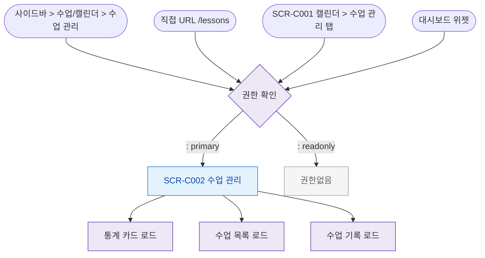

## 1. 목적
SCR-C002 수업 관리 화면으로 진입할 수 있는 모든 경로를 정의한다.

## 2. 전제조건
- 로그인 완료

## 3. 다이어그램

## 4. 엣지 설명

| 출발 | 도착 | 조건 |
|------|------|------|
| 사이드바 | Auth | 메뉴 클릭 |
| SCR-C001 탭 | Auth | 탭 클릭 |
| Auth | SCR_C002 | 권한 있음 |
| Auth | Blocked | readonly |
