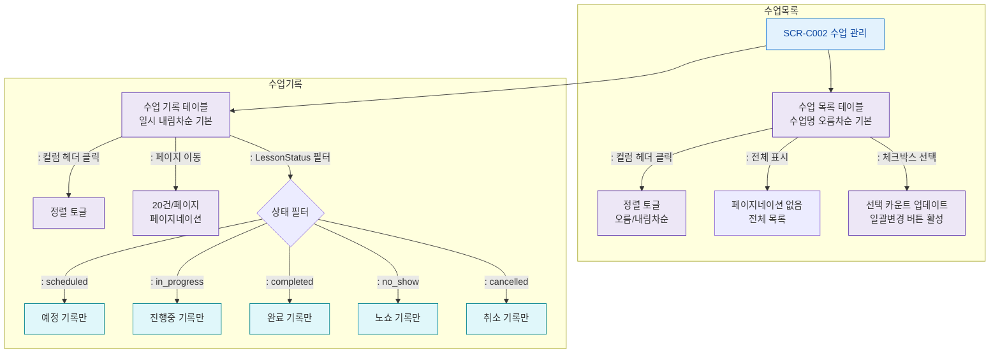

## 1. 목적
SCR-C002의 수업 목록/수업 기록 테이블의 정렬, 페이지네이션 플로우를 정의한다.

## 2. 전제조건
- SCR-C002 진입, 데이터 로드 완료

## 3. 다이어그램

## 4. 엣지 설명

| 구분 | 기본 정렬 | 페이지네이션 |
|------|----------|------------|
| 수업 목록 | 수업명 오름차순 | 전체 표시 |
| 수업 기록 | 일시 내림차순 | 20건/페이지 |
