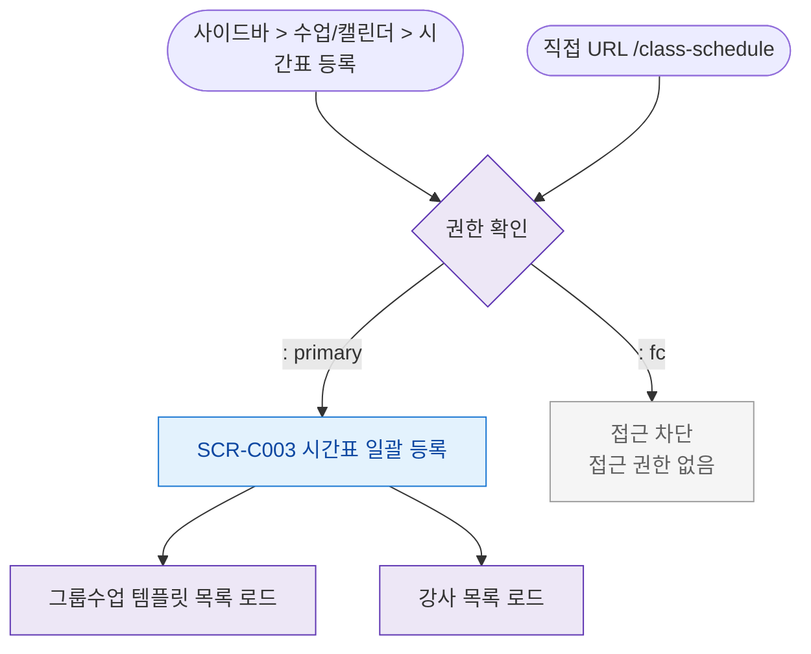

## 1. 목적
SCR-C003 시간표 일괄 등록으로 진입 가능한 경로를 정의한다.

## 2. 전제조건
- 로그인 완료

## 3. 다이어그램

```mermaid
flowchart TD
  SB([사이드바 > 수업/캘린더 > 시간표 등록]) --> Auth{권한 확인}
  URL([직접 URL /class-schedule]) --> Auth

  Auth -->|": primary"|SCR_C003[SCR-C003 시간표 일괄 등록]
  Auth -->|": fc"|Blocked[접근 차단\n접근 권한 없음]

  SCR_C003 --> LoadTemplates[그룹수업 템플릿 목록 로드]
  SCR_C003 --> LoadStaff[강사 목록 로드]

  classDef screen fill:#E3F2FD,stroke:#1976D2,color:#0D47A1
  classDef system fill:#EDE7F6,stroke:#5E35B2
  classDef rbacBlocked fill:#F5F5F5,stroke:#9E9E9E,color:#616161
  class SCR_C003 screen
  class Auth,LoadTemplates,LoadStaff system
  class Blocked rbacBlocked
```

## 4. 엣지 설명

| 출발 | 도착 | 조건 |
|------|------|------|
| Auth | SCR_C003 | manager 이상 |
| Auth | Blocked | fc |
