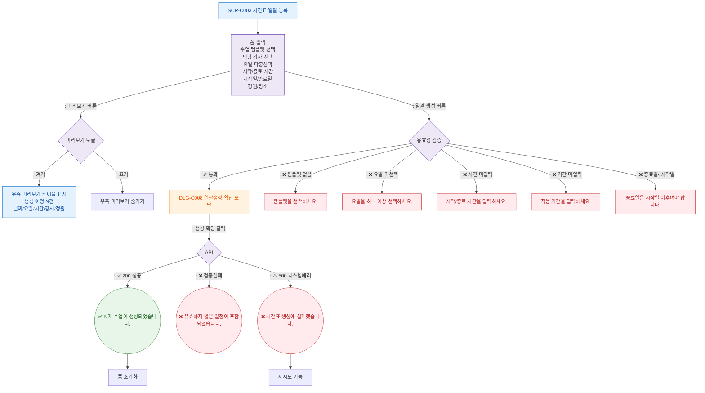

## 1. 목적
SCR-C003의 Happy Path — 템플릿 선택 → 요일/기간 설정 → 미리보기 → 일괄 생성의 정상 흐름. F2 메인은 3갈래 분기(성공/검증실패/시스템에러)를 강제한다.

## 2. 전제조건
- SCR-C003 진입, 템플릿 목록 로드 완료

## 3. 다이어그램

## 4. 엣지 설명

| 출발 | 도착 | 조건 |
|------|------|------|
| Valid | DLG_C008 | 검증 통과 |
| Valid | 각 에러 | 검증 실패 케이스 |
| BulkCreate | ToastOK | 200 성공 (정상 분기) |
| BulkCreate | ToastValid | 검증 실패 분기 |
| BulkCreate | ToastErr | 시스템 에러 분기 |
