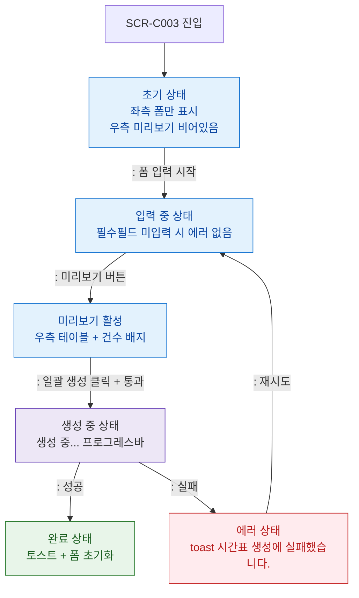

## 1. 목적
SCR-C003의 초기/입력중/미리보기/생성중/에러 UI 상태를 정의한다.

## 2. 전제조건
- SCR-C003 진입

## 3. 다이어그램

## 4. 엣지 설명

| 상태 | 설명 |
|------|------|
| 초기 | 좌측 폼만, 우측 비어있음 |
| 미리보기 활성 | 우측 테이블 + 건수 배지 |
| 생성 중 | 프로그레스바 |
| 완료 | 토스트 + 폼 초기화 |
| 에러 | toast |
