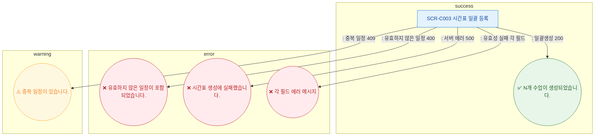

## 1. 목적
SCR-C003에서 발생 가능한 모든 토스트 메시지 조건을 정의한다.

## 2. 전제조건
- SCR-C003 활성

## 3. 다이어그램

## 4. 엣지 설명

| 토스트 | 타입 | 트리거 |
|--------|------|--------|
| N개 수업이 생성되었습니다. | success | 200 |
| 유효하지 않은 일정 포함 | error | 400 |
| 시간표 생성에 실패 | error | 500 |
| 중복 일정 | warning | 409 |
