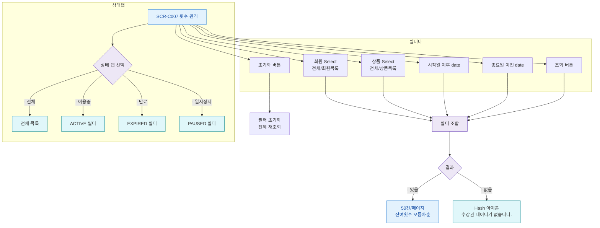

## 1. 목적
SCR-C007의 필터(회원/상품/기간/상태탭), 정렬, 페이지네이션 플로우를 정의한다.

## 2. 전제조건
- SCR-C007 진입 완료

## 3. 다이어그램

## 4. 엣지 설명

| 구분 | 기본값 | 정렬 | 페이지 |
|------|--------|------|--------|
| 기본 정렬 | 잔여횟수 오름차순 (소진 임박 상단) | - | 50건/페이지 |
| 상태탭 기본 | 전체 | - | - |
