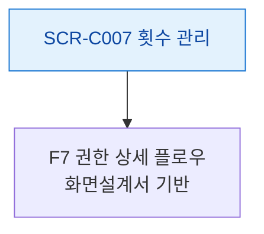

## 1. 목적
SCR-C007 횟수 관리 — F7 권한 플로우

## 2. 전제조건
- SCR-C007 진입 완료 (권한 확인 후)

## 3. 다이어그램

```mermaid
flowchart TD
  SCR[SCR-C007 횟수 관리]
  SCR --> Placeholder[F7 권한 상세 플로우\n화면설계서 기반]

  classDef screen fill:#E3F2FD,stroke:#1976D2,color:#0D47A1
  class SCR screen
```

## 4. 엣지 설명
- 화면설계서 SCR-C007 기반
