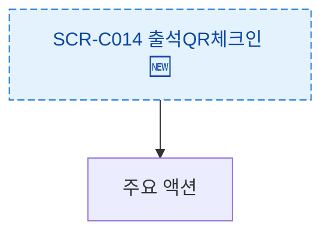

## 1. 목적
SCR-C014 버튼 액션을 정의한다.

## 2. 전제조건
- SCR-C014 진입 완료

## 3. 다이어그램

```mermaid
flowchart TD
  SCR_NODE[SCR-C014 출석QR체크인 🆕]
  SCR_NODE --> PrimaryAction[주요 액션]
  classDef screen fill:#E3F2FD,stroke:#1976D2,color:#0D47A1
  classDef newFeature fill:#F3E5F5,stroke:#7B1FA2,color:#4A148C,stroke-dasharray:6 3
  class SCR_NODE newFeature
  class SCR_NODE screen
```

## 4. 엣지 설명

| 버튼 | 동작 |
|------|------|
| 주요 버튼 | 액션 실행 |
