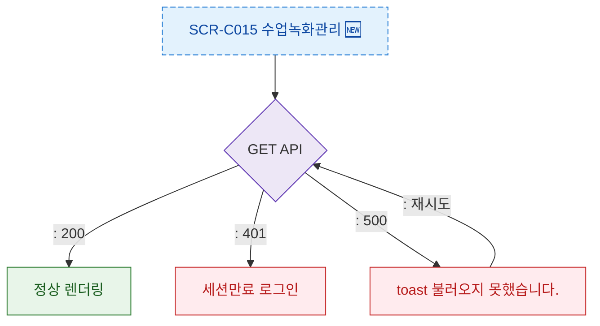

## 1. 목적
SCR-C015 에러 코드별 분기와 복구 경로를 정의한다.

## 2. 전제조건
- SCR-C015 진입 또는 액션 실행 중

## 3. 다이어그램

## 4. 엣지 설명

| 에러 | 코드 | 동작 |
|------|------|------|
| 데이터 로드 실패 | 500 | 에러 토스트 + 재시도 |
| 세션 만료 | 401 | 로그인 이동 |
