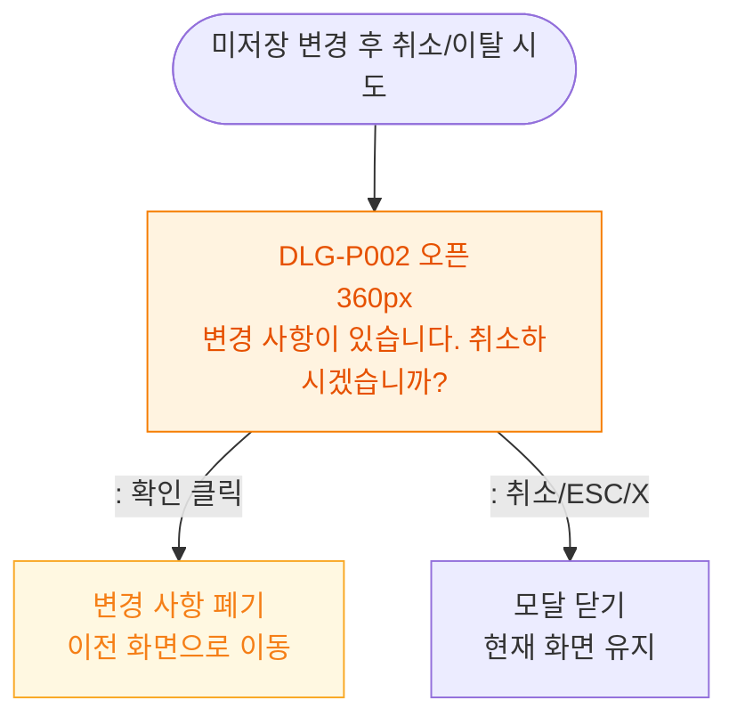

# M1 모달 생명주기 — DLG-P002 작업 취소 확인

## 다이어그램

## TC 후보

| TC ID | 타입 | Given | When | Then |
|-------|------|-------|------|------|
| TC-DLG-P002-M1-01 | positive | 미저장 변경 후 취소 클릭 | 확인 클릭 | 변경 폐기, 이전 화면 이동 |
| TC-DLG-P002-M1-02 | positive | 확인 다이얼로그 | 취소 클릭 | 모달 닫힘, 편집 화면 유지 |
