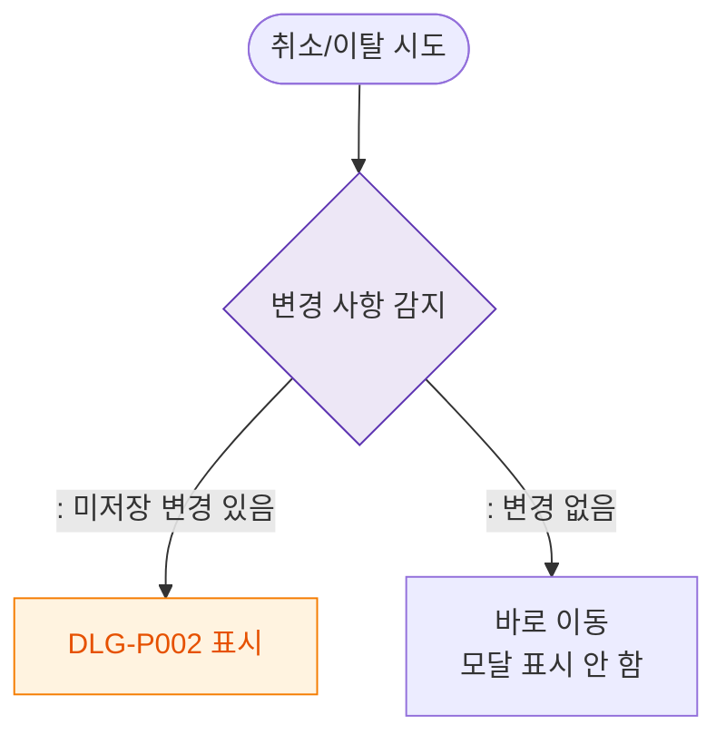

# M2 필드 검증 — DLG-P002 작업 취소 확인

## 다이어그램

```mermaid
flowchart TD
    TRIGGER([취소/이탈 시도]) --> DirtyCheck{변경 사항 감지}
    DirtyCheck -->|": 미저장 변경 있음"|ShowModal[DLG-P002 표시]
    DirtyCheck -->|": 변경 없음"|DirectLeave[바로 이동\n모달 표시 안 함]

    classDef modal fill:#FFF3E0,stroke:#F57C00,color:#E65100
    classDef system fill:#EDE7F6,stroke:#5E35B2
    class ShowModal modal
    class DirtyCheck system
```

## TC 후보

| TC ID | 타입 | Given | When | Then |
|-------|------|-------|------|------|
| TC-DLG-P002-M2-01 | positive | 변경 없음 | 취소 클릭 | 모달 없이 바로 이동 |
