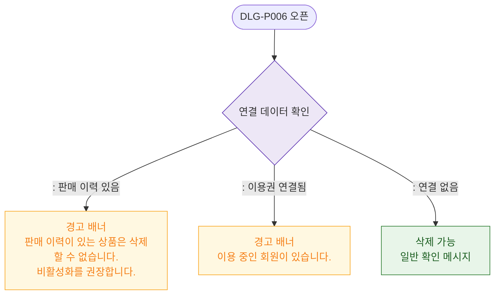

# M2 필드 검증 — DLG-P006 상품 삭제 확인

## 다이어그램

## TC 후보

| TC ID | 타입 | Given | When | Then |
|-------|------|-------|------|------|
| TC-DLG-P006-M2-01 | negative | 판매 이력 있는 상품 | 삭제 버튼 클릭 | 경고 배너 "삭제 불가, 비활성화 권장" |
| TC-DLG-P006-M2-02 | positive | 연결 없는 상품 | 삭제 버튼 클릭 | 일반 삭제 확인 메시지 |
