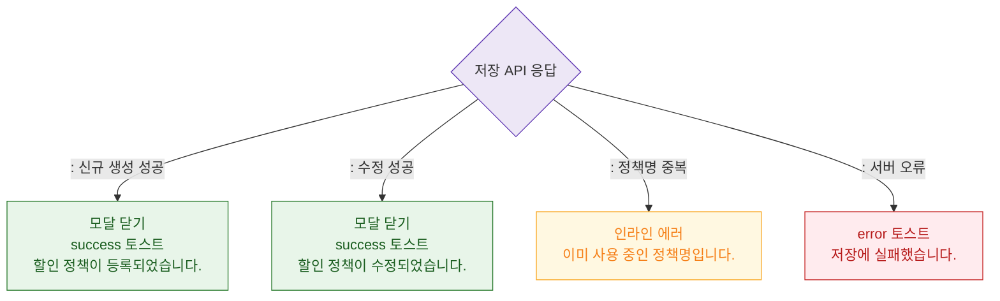

# M3 결과 분기 — DLG-P007 할인 정책 추가/수정

## 다이어그램

## TC 후보

| TC ID | 타입 | Given | When | Then |
|-------|------|-------|------|------|
| TC-DLG-P007-M3-01 | positive | 신규 정책 저장 | API 성공 | 모달 닫힘, "등록되었습니다." |
| TC-DLG-P007-M3-02 | negative | 정책명 중복 | API 거부 | 인라인 에러 "이미 사용 중인 정책명" |
| TC-DLG-P007-M3-03 | negative | API 500 | 저장 클릭 | error 토스트 |
