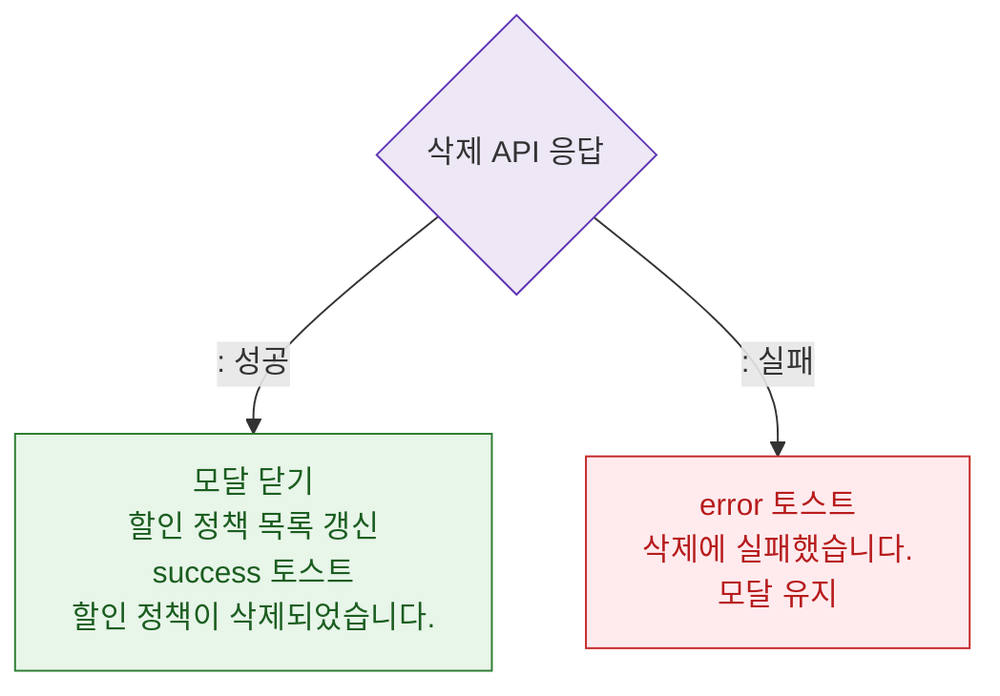

# M3 결과 분기 — DLG-P008 할인 정책 삭제 확인

## 다이어그램

## TC 후보

| TC ID | 타입 | Given | When | Then |
|-------|------|-------|------|------|
| TC-DLG-P008-M3-01 | positive | 삭제 성공 | API 200 | 모달 닫힘, 목록 갱신, success 토스트 |
| TC-DLG-P008-M3-02 | negative | API 500 | 삭제 확인 | error 토스트, 모달 유지 |
