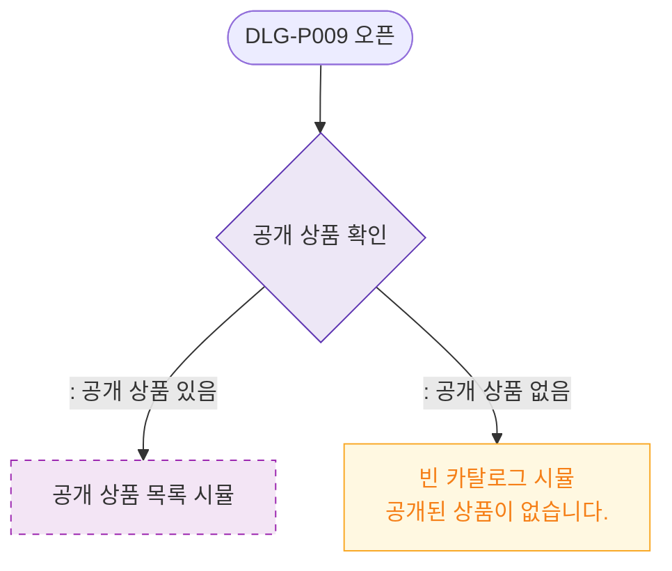

# M2 필드 검증 — DLG-P009 카탈로그 미리보기 🆕

## 다이어그램

## TC 후보

| TC ID | 타입 | Given | When | Then |
|-------|------|-------|------|------|
| TC-DLG-P009-M2-01 | positive | 공개 상품 없음 | 미리보기 오픈 | 빈 카탈로그 시뮬 "공개된 상품 없음" |
