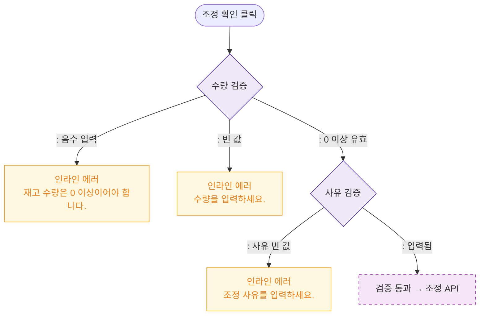

# M2 필드 검증 — DLG-P014 재고 조정 🆕

## 다이어그램

## TC 후보

| TC ID | 타입 | Given | When | Then |
|-------|------|-------|------|------|
| TC-DLG-P014-M2-01 | negative | 음수 수량 입력 | 조정 확인 | 인라인 에러 "0 이상이어야 합니다." |
| TC-DLG-P014-M2-02 | negative | 사유 빈 값 | 조정 확인 | 인라인 에러 "사유를 입력하세요." |
