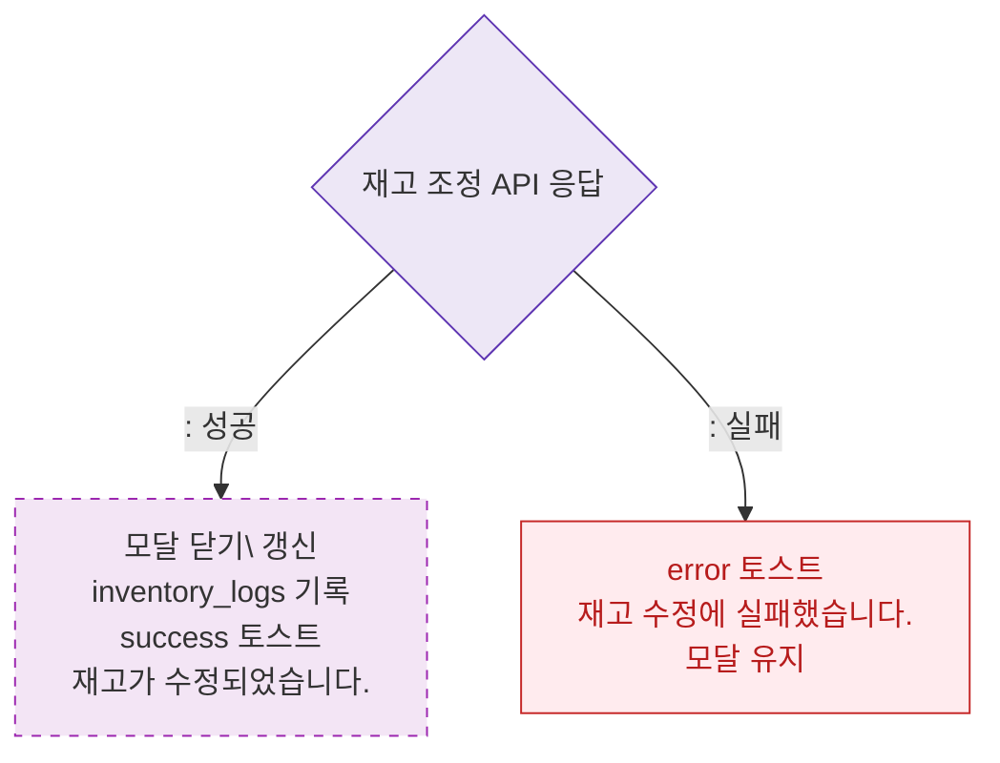

# M3 결과 분기 — DLG-P014 재고 조정 🆕

## 다이어그램

## TC 후보

| TC ID | 타입 | Given | When | Then |
|-------|------|-------|------|------|
| TC-DLG-P014-M3-01 | positive | 조정 성공 | API 200 | 재고 갱신, inventory_logs 기록 |
| TC-DLG-P014-M3-02 | negative | API 실패 | 조정 확인 | error 토스트, 모달 유지 |
