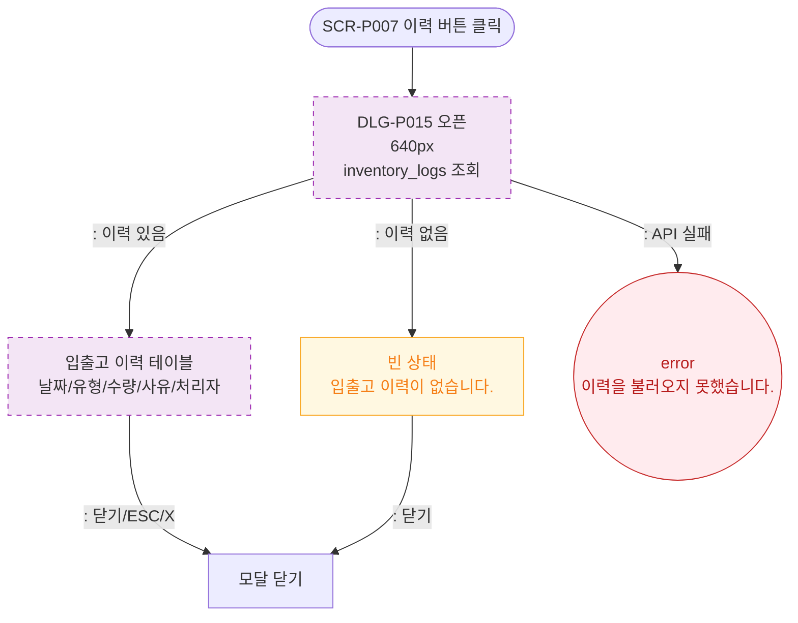

# M1 모달 생명주기 — DLG-P015 입출고 이력 🆕

## 다이어그램

## TC 후보

| TC ID | 타입 | Given | When | Then |
|-------|------|-------|------|------|
| TC-DLG-P015-M1-01 | positive | 이력 있음 | 이력 버튼 클릭 | 입출고 이력 테이블 표시 |
| TC-DLG-P015-M1-02 | negative | API 실패 | 이력 버튼 클릭 | error 토스트 |
