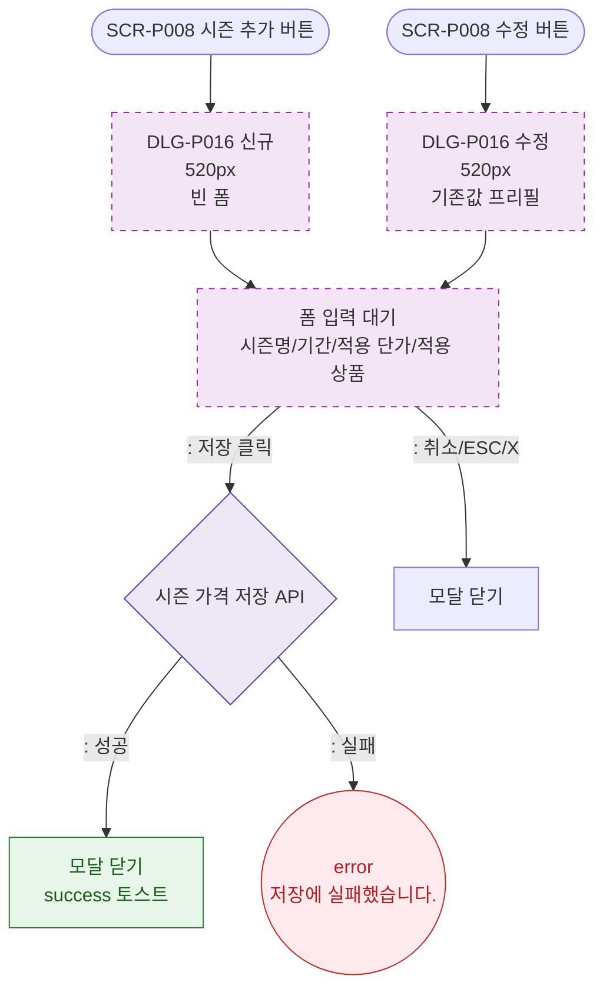

# M1 모달 생명주기 — DLG-P016 시즌 가격 등록/수정 🆕

## 다이어그램

## TC 후보

| TC ID | 타입 | Given | When | Then |
|-------|------|-------|------|------|
| TC-DLG-P016-M1-01 | positive | 유효한 시즌 가격 입력 | 저장 클릭 | 모달 닫힘, success 토스트 |
| TC-DLG-P016-M1-02 | negative | API 실패 | 저장 클릭 | error 토스트, 모달 유지 |
