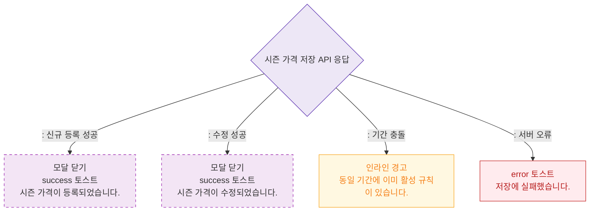

# M3 결과 분기 — DLG-P016 시즌 가격 등록/수정 🆕

## 다이어그램

## TC 후보

| TC ID | 타입 | Given | When | Then |
|-------|------|-------|------|------|
| TC-DLG-P016-M3-01 | positive | 신규 시즌 저장 | API 201 | 모달 닫힘, "등록되었습니다." |
| TC-DLG-P016-M3-02 | negative | 기간 충돌 | API 거부 | 인라인 경고 "동일 기간 활성 규칙 있음" |
| TC-DLG-P016-M3-03 | negative | API 500 | 저장 클릭 | error 토스트 |
