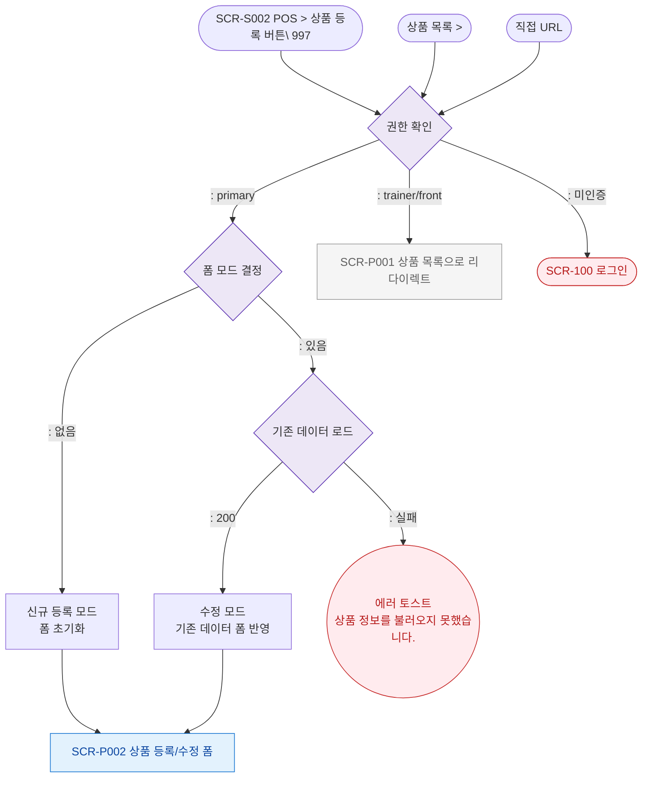

# F1 진입 플로우 — SCR-P002 상품 등록/수정 레거시

## 목적
SCR-P002(, )로 진입 가능한 경로를 정의한다.

## 다이어그램

## TC 후보

| TC ID | 타입 | Given | When | Then |
|-------|------|-------|------|------|
| TC-P002-F1-01 | positive | 매니저 로그인 | 진입 | 신규 모드 폼 초기화 |
| TC-P002-F1-02 | positive | 매니저 로그인 | 진입 | 기존 상품 데이터 폼 반영 |
| TC-P002-F1-03 | negative | trainer 로그인 | 진입 | 상품 목록으로 리다이렉트 |
