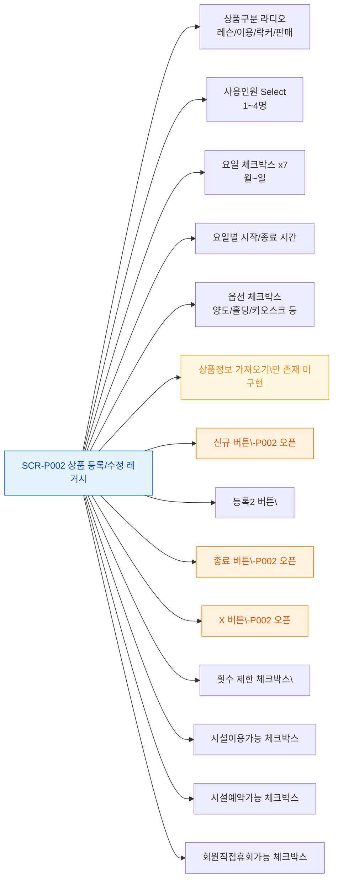

# F3 버튼/액션 매핑 — SCR-P002 상품 등록/수정 레거시

## 다이어그램

## TC 후보

| TC ID | 타입 | Given | When | Then |
|-------|------|-------|------|------|
| TC-P002-F3-01 | positive | 레슨 선택 | 상품구분 라디오 레슨 | 레슨시간/유효기간/수업구분 필드 활성화 |
| TC-P002-F3-02 | positive | 이용 선택 | 상품구분 라디오 이용 | 이용구분/기간/횟수 필드 활성화 |
