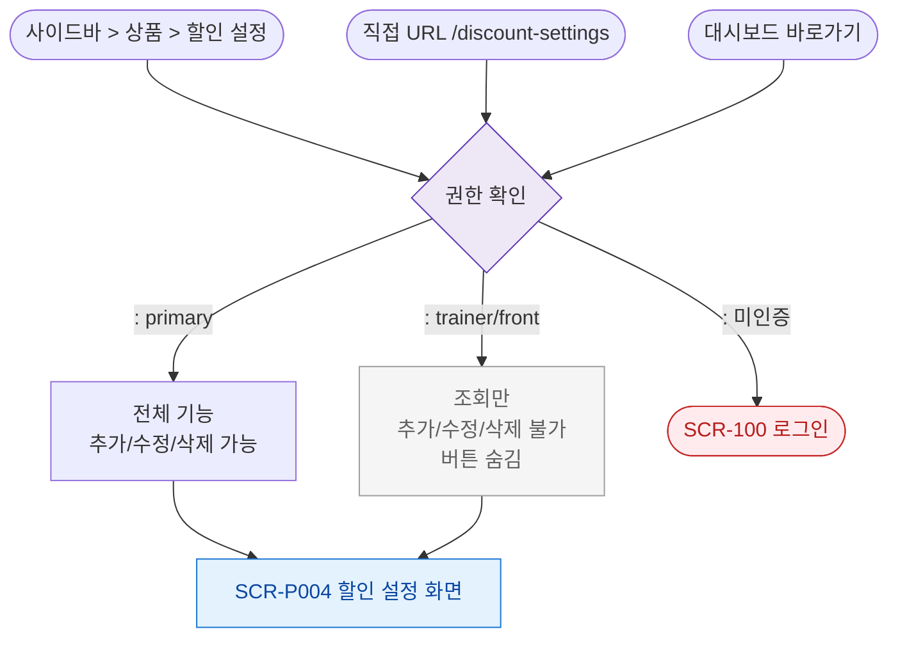

# F1 진입 플로우 — SCR-P004 할인 설정

## 다이어그램

## TC 후보

| TC ID | 타입 | Given | When | Then |
|-------|------|-------|------|------|
| TC-P004-F1-01 | positive | 매니저 로그인 | 사이드바 할인 설정 클릭 | /discount-settings 진입, 전체 기능 |
| TC-P004-F1-02 | positive | trainer 로그인 | 할인 설정 진입 | 조회만 가능, 추가 버튼 숨김 |
