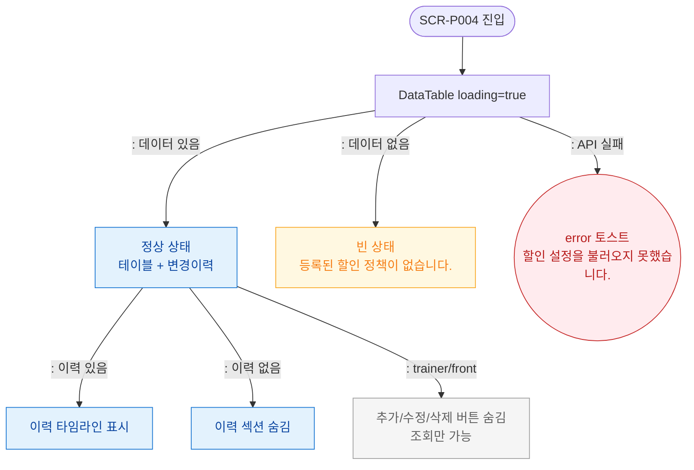

# F6 상태별 화면 플로우 — SCR-P004 할인 설정

## 다이어그램

## TC 후보

| TC ID | 타입 | Given | When | Then |
|-------|------|-------|------|------|
| TC-P004-F6-01 | positive | 로딩 중 | 페이지 진입 | DataTable loading 표시 |
| TC-P004-F6-02 | positive | 빈 목록 | 페이지 진입 | "등록된 할인 정책이 없습니다." |
| TC-P004-F6-03 | negative | API 실패 | 페이지 진입 | error 토스트 표시 |
