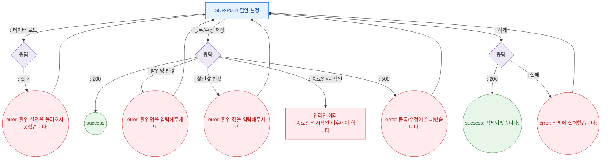

# F8 에러/예외/복구 플로우 — SCR-P004 할인 설정

## 다이어그램

## TC 후보

| TC ID | 타입 | Given | When | Then |
|-------|------|-------|------|------|
| TC-P004-F8-01 | negative | 할인명 공백 | 등록 저장 | error 토스트 "할인명을 입력해주세요." |
| TC-P004-F8-02 | negative | 할인값 공백 | 등록 저장 | error 토스트 "할인 값을 입력해주세요." |
| TC-P004-F8-03 | negative | 종료일 < 시작일 | 등록 저장 | 인라인 에러 "종료일은 시작일 이후여야 합니다." |
