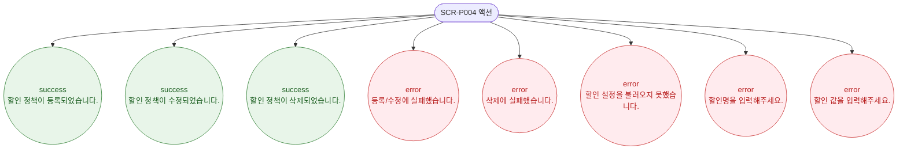

# F9 토스트/피드백 플로우 — SCR-P004 할인 설정

## 다이어그램

## TC 후보

| TC ID | 타입 | Given | When | Then |
|-------|------|-------|------|------|
| TC-P004-F9-01 | positive | 등록 성공 | DLG-P007 등록 | success 토스트 |
| TC-P004-F9-02 | positive | 수정 성공 | DLG-P007 수정 저장 | success 토스트 |
| TC-P004-F9-03 | positive | 삭제 성공 | DLG-P008 삭제 확인 | success 토스트 |
