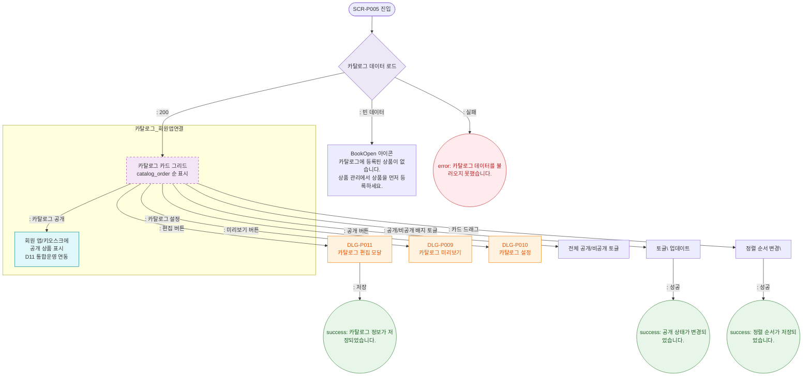

# F2 메인 인터랙션 플로우 — SCR-P005 상품 카탈로그 🆕

## 다이어그램

## TC 후보

| TC ID | 타입 | Given | When | Then |
|-------|------|-------|------|------|
| TC-P005-F2-01 | positive | 카탈로그 상품 있음 | 페이지 진입 | 카드 그리드 표시, catalog_order 순 |
| TC-P005-F2-02 | positive | 공개 카드 | 배지 클릭 | 비공개 전환, success 토스트 |
| TC-P005-F2-03 | positive | 카드 드래그 | 순서 변경 | catalog_order 업데이트, success 토스트 |
| TC-P005-F2-04 | positive | 편집 버튼 | 클릭 | DLG-P011 오픈 |
