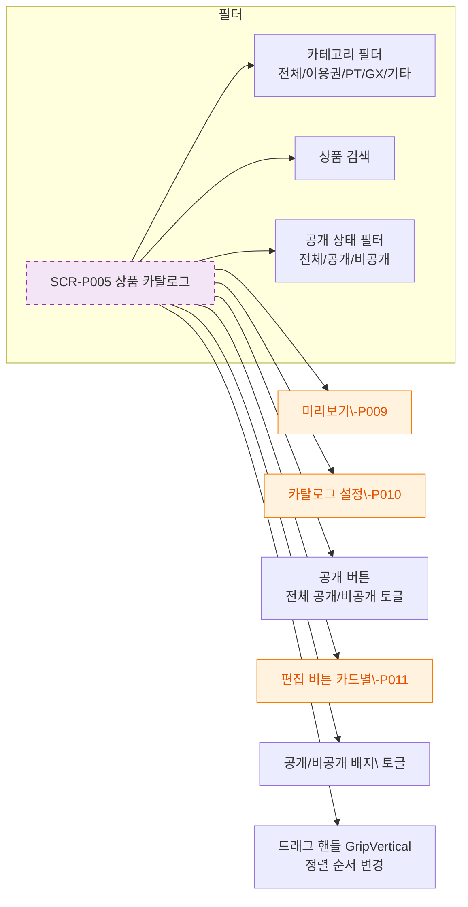

# F3 버튼/액션 매핑 — SCR-P005 상품 카탈로그 🆕

## 다이어그램

## TC 후보

| TC ID | 타입 | Given | When | Then |
|-------|------|-------|------|------|
| TC-P005-F3-01 | positive | trainer | 카탈로그 진입 | 미리보기 가능, 편집 버튼 없음 |
