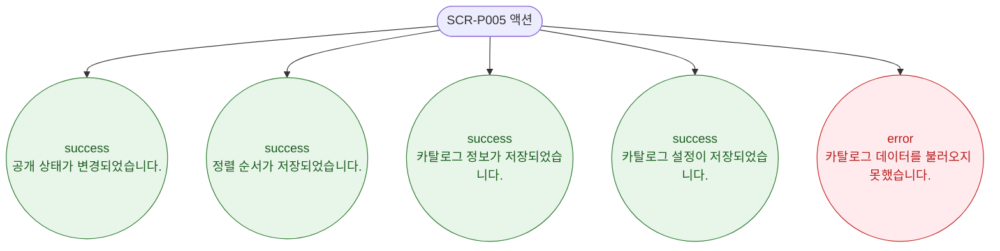

# F9 토스트/피드백 플로우 — SCR-P005 상품 카탈로그 🆕

## 다이어그램

## TC 후보

| TC ID | 타입 | Given | When | Then |
|-------|------|-------|------|------|
| TC-P005-F9-01 | positive | 공개 토글 | 배지 클릭 | success 토스트 "공개 상태가 변경되었습니다." |
| TC-P005-F9-02 | positive | 드래그 완료 | 카드 순서 변경 | success 토스트 "정렬 순서가 저장되었습니다." |
| TC-P005-F9-03 | positive | 카탈로그 편집 저장 | DLG-P011 저장 | success 토스트 "카탈로그 정보가 저장되었습니다." |
