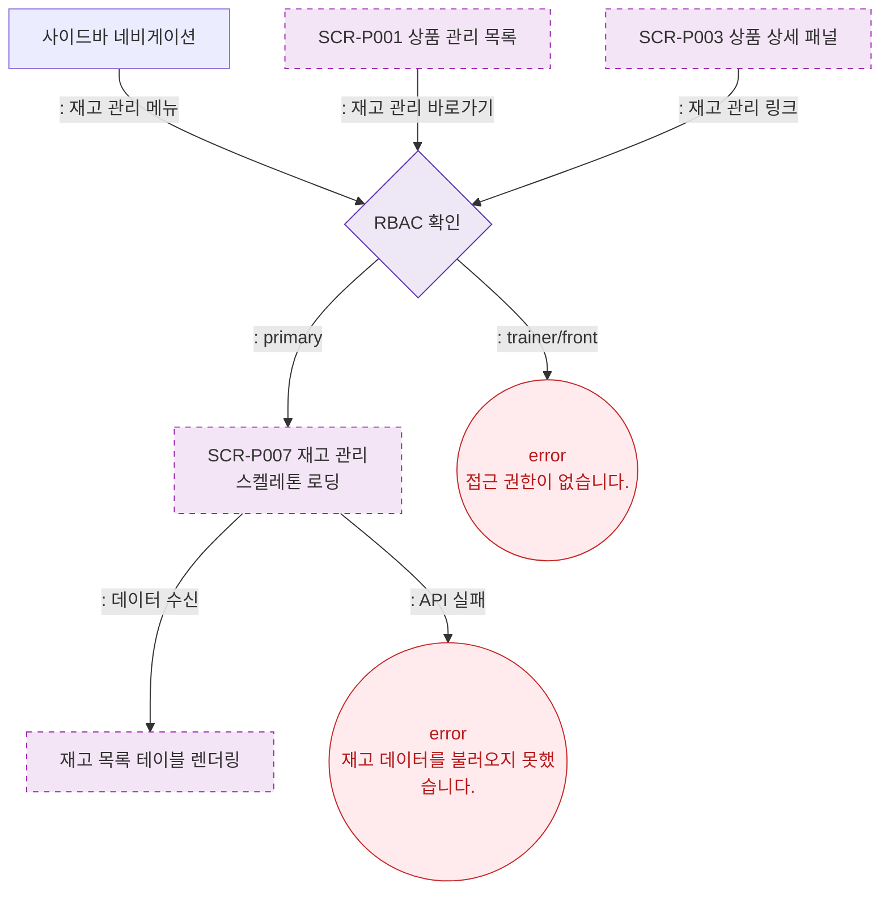

# F1 진입 플로우 — SCR-P007 재고 관리 🆕

## 목적
재고 관리 화면(SCR-P007)으로 진입하는 모든 경로와 초기 렌더링 상태를 정의한다.

## 전제조건
- SCR-P001 상품 관리 목록 사이드바 메뉴에서 진입
- SCR-P003 상품 상세 패널의 "재고 관리" 바로가기에서 진입 가능
- RBAC: primary만 접근, trainer/front는 진입 차단

## 다이어그램

## TC 후보

| TC ID | 타입 | Given | When | Then |
|-------|------|-------|------|------|
| TC-P007-F1-01 | positive | manager | 재고 관리 메뉴 클릭 | SCR-P007 진입, 재고 목록 표시 |
| TC-P007-F1-02 | negative | trainer | 재고 관리 메뉴 클릭 | error 토스트 "접근 권한이 없습니다." |
| TC-P007-F1-03 | negative | API 실패 | 페이지 진입 | error 토스트 "재고 데이터를 불러오지 못했습니다." |
